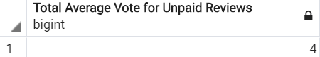

# Module 16 Challenge - Big Data

## Challenge Overview

The goals of this challenge are to:

- Perform ETL on one of the review datasets.
- Store your results on an AWS RDS database.
- Determine if reviews are biased using PySpark or SQL with the appropriate statistical methods.

## Resources

Data Sources: [amazon_reviews_us_Toys_v1_00](https://s3.amazonaws.com/amazon-reviews-pds/tsv/amazon_reviews_us_Toys_v1_00.tsv.gz)

Software: Google Colab Notebook, Amazon AWS, PostgreSQL

## Analysis

**1. Total number of reviews**

 

**2. Total number of helpful reviews**

 

**3. Total average vote**

  

**4. Total number of 5-star reviews**

  

**5. Count by star rating**

  

Paid reviews barely comprise 1% of total reviews (#1), just about 2% of total helpful votes (#2), and almost 1% of total 5-star reviews (#4), showing that the vast amount of reviews are unpaid. Further, there is no perceived difference between paid and unpaid reviews regarding total average vote (#3), both around 4 stars. 

Based on the spread of ratings (#5), it appears that unpaid reviews are much more likely to produce a 5 star rating (63%) over paid reviews (41%), however, paid reviews are also less likely to provide a review less than or equal to 2 stars (combined 5%) versus unpaid reviews (combined 13%), potentially leading to a conclusion that paid reviews are generally more biased towards a positive review. There is a trade-off however, in that paid reviews are also more spread out with their 3 star and greater reviews as compared to unpaid, leading one to believe a more honest review is achieved with a paid review. Since both paid and unpaid reviews under 3 star comprises roughly 20% of total reviews for both groups, focusing on the spread between 4 and 5 stars exclusively, it is concluded that paid reviews are more honest and therefore more trustworthy reviews than unpaid strictly due to the even distribution of 4 and 5 star ratings.

## Report completed by:

